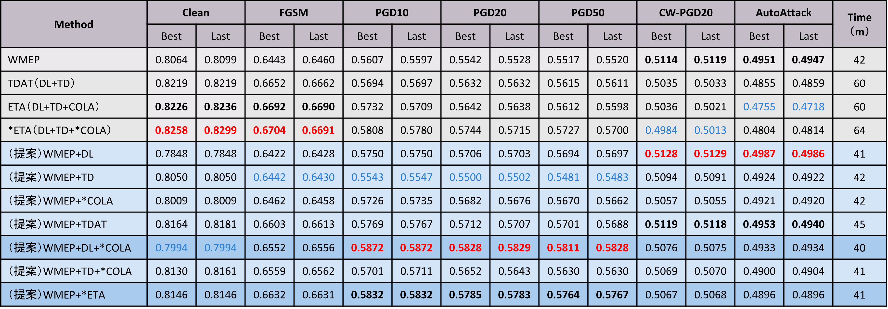
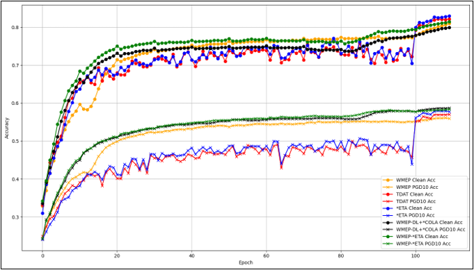
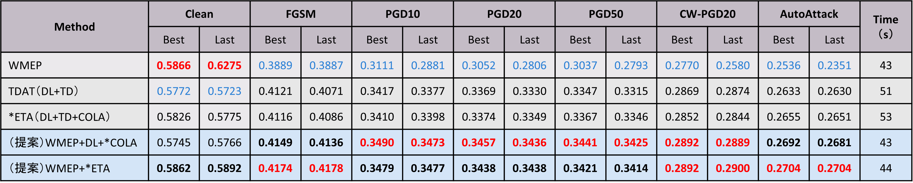
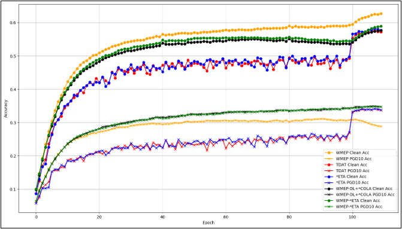

# WMEP-ETA: Fast Adversarial Training with Efficient Techniques

This repository provides the code, models, and logs used in my graduation research on adversarial robustness, especially focusing on the WMEP-ETA method for CIFAR-10/CIFAR-100.

---

## 🧠 Overview

- 🎯 Goal: Improve adversarial robustness
- 🧪 Dataset: CIFAR-10, CIFAR-100
- ⚔️ Attacks: FGSM, PGD, AutoAttack, CW
- 🛡 Methods: WMEP-ETA
- 📊 Evaluation: Clean accuracy, robust accuracy under multiple attacks

---

## 🗂 Repository Structure
```
WMEP-ETA/
├── CIFAR10/                     # CIFAR-10における実験結果
│   ├── log/                     # 実験ログ（.logファイル）
│   ├── test_model/              # テスト用学習済みモデル（チェックポイント）
│   └── test_result/             # 評価結果（CSVやグラフなど）
│
├── CIFAR100/                    # CIFAR-100における実験結果（CIFAR10と同構成）
│   ├── log/
│   ├── test_model/
│   └── test_result/
│
├── CIFAR10_models/              # CIFAR-10用モデル定義（例：EfficientNet, ResNetなど）
│   ├── efficientnet.py
│   ├── resnet.py
│   └── ...
│
├── CIFAR100_models/             # CIFAR-100用モデル定義（CIFAR10と同様）
│   ├── efficientnet.py
│   ├── resnet.py
│   └── ...
│
├── autoattack/                  # AutoAttack評価用のスクリプト群
│   ├── autoattack.py
│   ├── autopgd_pt.py
│   ├── fab_pt.py
│   ├── square.py
│   └── ...
│
├── image/                       # 実験結果の図表
│ ├── cifar10_results_table.png
│ ├── cifar10_accuracy_curve.png
│ ├── cifar100_results_table.png
│ └── cifar100_accuracy_curve.png
│
├── ETA_WMEP_CIFAR10.py          # CIFAR-10用のWMEP+ETA学習スクリプト
├── ETA_WMEP_CIFAR100.py         # CIFAR-100用のWMEP+ETA学習スクリプト
│
├── test_cifar10.py              # CIFAR-10の評価実行スクリプト
├── test_cifar100.py             # CIFAR-100の評価実行スクリプト
│
├── run.ipynb                    # 実行用ノートブック
│
└── README.md                    # このファイル
```
---

## 🚀 How to Reproduce

I recommend using the interactive notebook for evaluation:
👉 [Open in Google Colab](https://colab.research.google.com/github/7i10/WMEP-ETA/blob/main/run.ipynb)

---

## 📊 Experimental Results

### 🔹 CIFAR-10 Results

**Table 1. Accuracy and Robustness (CIFAR-10).**





**Figure 1. Accuracy vs Epoch Curve (CIFAR-10).**

### 🔹 CIFAR-100 Results

**Table 2. Accuracy and Robustness (CIFAR-100).**





**Figure 2. Accuracy vs Epoch Curve (CIFAR-100).** 

---

## 📦 Pretrained Models

You can find the pretrained models here:

- [CIFAR10/test_model/](./CIFAR10/test_model/)
- [CIFAR100/test_model/](./CIFAR100/test_model/)
  
---

## 📃 License

MIT License

---

## 📚 References

- [WMEP: Improving Fast Adversarial Training with Prior-Guided Knowledge](http://arxiv.org/abs/2304.00202)
- [TDAT: Taxonomy Driven Fast Adversarial Training](https://ojs.aaai.org/index.php/AAAI/article/view/28330)
- [ETA: Improving Fast Adversarial Training Paradigm: An Example Taxonomy Perspective](http://arxiv.org/abs/2408.03944)
- [FGSM: Explaining and Harnessing Adversarial Examples](https://arxiv.org/abs/1412.6572)
- [PGD: Towards Deep Learning Models Resistant to Adversarial Attacks](https://arxiv.org/abs/1706.06083)
- [CW: Towards Evaluating the Robustness of Neural Networks](https://arxiv.org/abs/1608.04644)
- [AutoAttack: Reliable Evaluation of Adversarial Robustness with an Ensemble of Diverse Parameter-Free Attacks](https://arxiv.org/abs/2003.01690)

---

## 💻 Code Repositories Referenced

- [WMEP (GitHub)](https://github.com/jiaxiaojunQAQ/FGSM-PGK)
  - The `CIFAR10_models/`, `CIFAR100_models/`, and `autoattack/` directories are directly reused.  
  - The script `ETA_WMEP_CIFAR10.py` and `ETA_WMEP_CIFAR100.py` were partially based on `FGSM_PGK_CIFAR10.py` from the WMEP repository.

- [TDAT (GitHub)](https://github.com/bookman233/TDAT)
  - The `utils/` module is directly reused.
  - The script `ETA_WMEP_CIFAR10.py` and `ETA_WMEP_CIFAR100.py` were partially based on `TDAT.py` from the TDAT repository.

---

## ✉️ Contact

If you have any questions, feel free to contact:

📧 sy.9n3vesj[at]gmail.com
